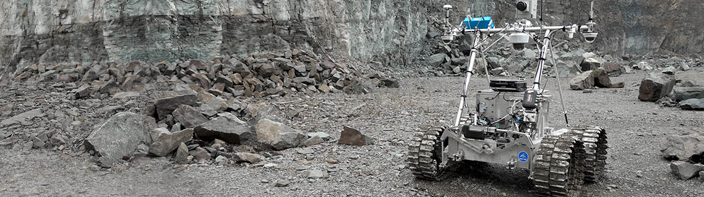

* [English](https://github.com/asc-csa/LEAD-Rover-Data-Tutorial#lunar-exploration-analogue-deployment-rover-data---a-tutorial-le-fran%C3%A7ais-suit) <br>
* [Français](https://github.com/asc-csa/LEAD-Rover-Data-Tutorial#d%C3%A9ploiement-dun-analogue-de-lexploration-lunaire-donn%C3%A9es-du-rover---un-tutoriel-english-precedes)
  
## Lunar Exploration Analogue Deployment Rover Data - A Tutorial (Le français suit)

### Background Information

In the time period between 2017-2019, The Canadian Space Agency (CSA) partnered with the European Space Agency (ESA) to conduct a series of field tests to replicate scenarios of a lunar sample return mission. This was to gain knowledge and hands-on experience to prepare for the next chapter of space exploration: sending human beings to more distant destinations like the Moon and Mars.

This mission simulation was conducted using the CSA'S Juno Rover: a rugged, all-terrain rover. These field tests were performed in three phases at two locations: a rock quarry and the CSA Analogue Terrain (also known as the Mars Yard) in Quebec. The rover was operated by teams based in Saint-Hubert (Quebec) and Germany to recreate the difficulty of long-distance communications.

This project was split as follows:

* **LEAD (HOPE)**: This focused on having trained operators carry out sample return missions. It took place over five days in October 2017 and four days in June 2019.
* **LEAD Rover Metrics Gathering Experiment (LRMGE)**: This part of the mission had six teams in June 2019 operate the rover along a pre-defined itinerary to gather metrics on rover driving performance.
* **LEAD Permanently Shadowed Region (PSR)**: Lastly, this part focused on rover driving tasks under dark lightning conditions emulating operations in a PSR. <br>

The dataset analyzed in this tutorial is from the **LEAD (PSR)** phase and took place in September 2019. It is in the form of a rosbag and provides imagery, LiDAR data, and the estimated pose of the rover.

You can read more about the mission here: <br>
**Juno Rover:** https://www.asc-csa.gc.ca/eng/multimedia/search/image/7824 <br>
**LEAD:** https://www.asc-csa.gc.ca/eng/rovers/mission-simulations/lunar-exploration-analogue-deployment.asp <br>
      https://www.hou.usra.edu/meetings/isairas2020fullpapers/pdf/5015.pdf <br>

### About
LEAD_Rover_Data_Tutorial.ipynb will guide the user on the steps to downloading and extracting the Rover data. Next, the tutorial will demonstrate how to open the data and save it as a CSV file, Point Cloud File or Image for further uses.
The last step involves creating a world map and plotting the rover's path and images taken on the path. 

*** 
### Quick Start


:exclamation: **Note:** If after the below steps you are unable to display the folium map, it may be required to run/re-start and/or install jupyter notebook into the same kernel that has the required packages.<br>

1. Setup a virtual environment or conda environment with the following version of python <br>
```
python = 3.8.8
```
2. Install requirements from the requirements.txt file by running the script (if using conda replace the below pip install with conda) <br>
```
pip install -r requirements.txt
```
3. Begin the tutorial found in the LEAD_Rover_Data_Tutorial.ipynb file. 

***
## Déploiement d'un Analogue de l'Exploration Lunaire Données du Rover - Un tutoriel (English precedes)

### Informations Générales
Entre 2017 et 2019, l'Agence spatiale canadienne (ASC) s'est associée à l'Agence spatiale européenne (ESA) pour mener une série d'essais sur le terrain afin de reproduire les scénarios d'une mission de retour d'échantillons lunaires. Il s'agissait d'acquérir des connaissances et une expérience pratique pour préparer le prochain chapitre de l'exploration spatiale : envoyer des êtres humains vers des destinations plus lointaines comme la Lune et Mars.

Cette simulation de mission a été réalisée à l'aide du rover Juno de l'ASC, un rover robuste et tout-terrain. Ces essais sur le terrain ont été réalisés en trois phases à deux endroits : une carrière de roches et le Terrain analogue de l'ASC (également connu sous le nom de cour de triage de Mars) au Québec. Le rover a été utilisé par des équipes basées à Saint-Hubert (Québec) et en Allemagne afin de recréer la difficulté des communications longue distance.

Ce projet a été divisé comme suit :
* **DEAL (HOPE)**: Il s'agissait de faire en sorte que des opérateurs formés effectuent des missions de retour d'échantillons. Il s'est déroulé sur cinq jours en octobre 2017 et sur quatre jours en juin 2019. 
* **DEAL Expérience de collecte de données de Rover**:  Dans le cadre de cette partie de la mission, six équipes ont fait fonctionner le rover en juin 2019 le long d'un itinéraire prédéfini afin de recueillir des données sur les performances de conduite du rover.
* **DEAL Région ombragée en permanence**: Enfin, cette partie s'est concentrée sur les tâches de conduite du rover dans des conditions d'éclairage sombre émulant les opérations dans une région ombragée en permanence. <br>

Le jeu de données analysé dans ce tutoriel provient de la **troisième phase** et a eu lieu en septembre 2019. Il se présente sous la forme d'un rosbag et fournit des images, des données LiDAR et la pose estimée du rover.

Pour en savoir plus sur la mission, cliquez ici: <br>
**Rover Juno:** https://www.asc-csa.gc.ca/eng/multimedia/search/image/7824 <br>
**DEAL:** https://www.asc-csa.gc.ca/eng/rovers/mission-simulations/lunar-exploration-analogue-deployment.asp <br>
      https://www.hou.usra.edu/meetings/isairas2020fullpapers/pdf/5015.pdf <br>

### Contexte
LEAD_Rover_Data_Tutorial.ipynb guidera l'utilisateur dans les étapes de téléchargement et d'extraction des données Rover. Ensuite, le didacticiel montre comment ouvrir les données et les enregistrer sous forme de fichier CSV, de fichier de nuage de points ou d'image en vue d'utilisations ultérieures.
La dernière étape consiste à créer une carte du monde et à tracer la trajectoire du rover et les images prises sur cette trajectoire. 
*** 
### Démarrage Rapide


:exclamation: **Remarque:** Si, après avoir suivi les étapes ci-dessous, vous ne parvenez pas à afficher la carte du folium, il peut être nécessaire d'exécuter, de redémarrer et/ou d'installer *Jupyter Notebook* dans le même noyau que celui qui contient les paquets nécessaires.<br>

1. Installez un environnement virtuel ou un environnement conda avec la version suivante de python <br>
```
python = 3.8.8
```
2. Installez les exigences à partir du fichier requirements.txt en exécutant le script (si vous utilisez conda, remplacez le script pip install ci-dessous par conda) <br>
```
pip install -r requirements.txt
```
3. Commencez le tutoriel qui se trouve dans le fichier LEAD_Rover_Data_Tutorial.ipynb. 

***

